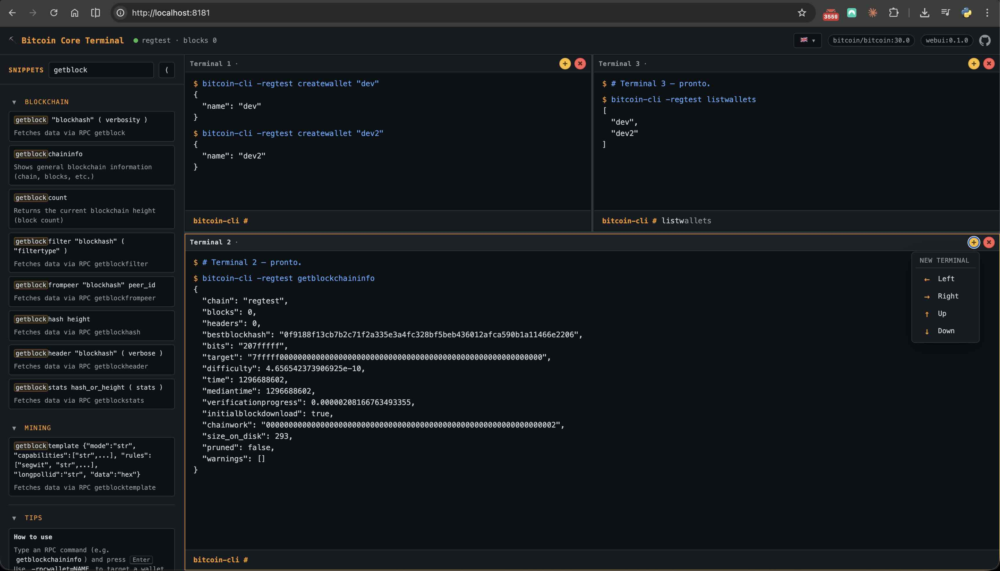
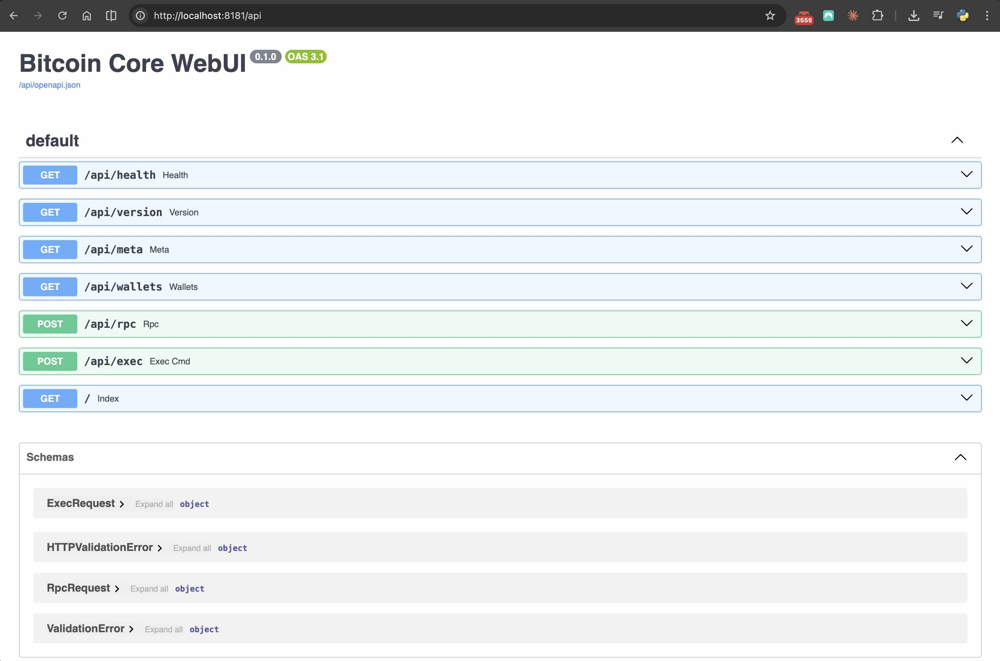

<div align="center">

# ⛏️ Bitcoin Core Terminal

### Local Bitcoin Core regtest lab with a browser-based terminal

[](https://bitcoincore.org/)
[](https://docs.docker.com/compose/)
[](https://www.python.org/)
[](https://fastapi.tiangolo.com/)
[](https://nginx.org/)

**🇬🇧 English** · [🇧🇷 Português](README.pt-BR.md)

</div>

---

## ⚡ TL;DR — Quick start

```bash
git clone https://github.com/gustavoschaedler/bitcoin-core-terminal.git
cd bitcoin-core-terminal
cp .env_template .env
docker compose up -d --build
open http://localhost:8181
```

That's it. You now have a fresh `bitcoin-core` regtest node and a browser terminal with snippets. See [Smoke test](#-smoke-test) to confirm it works.

## Interfaces

You can interact with the node in two ways: a browser WebUI and an HTTP API to send RPC commands.

<table>
<tr>
<td align="center" width="50%">
<sub><b>WebUI</b></sub><br/>

</td>
<td align="center" width="50%">
<sub><b>HTTP API (RPC)</b></sub><br/>

</td>
</tr>
</table>

---

## 📖 Table of contents

- [⛏️ Bitcoin Core Terminal](#️-bitcoin-core-terminal)
    - [Local Bitcoin Core regtest lab with a browser-based terminal](#local-bitcoin-core-regtest-lab-with-a-browser-based-terminal)
  - [⚡ TL;DR — Quick start](#-tldr--quick-start)
  - [Interfaces](#interfaces)
  - [📖 Table of contents](#-table-of-contents)
  - [📦 What's in the box](#-whats-in-the-box)
  - [✅ Prerequisites](#-prerequisites)
  - [⚙️ Configuration (.env)](#️-configuration-env)
  - [🚀 Start the stack](#-start-the-stack)
  - [🧪 Smoke test](#-smoke-test)
  - [🛠️ Using bitcoin-cli](#️-using-bitcoin-cli)
  - [💻 Web Terminal](#-web-terminal)
  - [🌐 HTTP API](#-http-api)
  - [🗂️ Project structure](#️-project-structure)
  - [🛡️ Network architecture](#️-network-architecture)
  - [🔌 Ports and credentials](#-ports-and-credentials)
  - [💾 Persistence and reset](#-persistence-and-reset)
  - [🔧 Troubleshooting](#-troubleshooting)
  - [📚 References](#-references)
  - [⚡ Donations](#-donations)

---

## 📦 What's in the box

- **`bitcoind`** (regtest) with data persisted in a named volume, plus a
  container-side healthcheck so dependent services only start once the node
  is actually responsive.
- **Web terminal** (FastAPI + HTML/CSS/JS) with snippets, draggable splits,
  language switcher (English / Portuguese) and terminal-like UX.
- **Proxy** (nginx) exposing only the UI on the host, with security headers
  and cache-busting for dev.

---

## ✅ Prerequisites

- Docker Engine + Docker Compose (plugin `docker compose`)

Verify:

```bash
docker --version
docker compose version
```

---

## ⚙️ Configuration (.env)

Copy the template before the first run (the `.env` file is gitignored on
purpose — it holds credentials):

```bash
cp .env_template .env
```

| Key                                | Purpose                                                                                    |
| ---------------------------------- | ------------------------------------------------------------------------------------------ |
| `HOST_PORT`                        | Host port published by the nginx proxy                                                     |
| `BITCOIN_REPO` · `BITCOIN_VERSION` | Bitcoin Core image (also used as a build stage to copy `bitcoin-cli` into the WebUI image) |
| `PYTHON_IMAGE`                     | Python base image for the WebUI container                                                  |
| `NGINX_IMAGE`                      | nginx image used by the reverse proxy                                                      |
| `VERSION`                          | Version label shown in the WebUI top bar                                                   |
| `BITCOIND_HOST` · `BITCOIND_PORT`  | RPC endpoint used by the WebUI                                                             |
| `BITCOIND_USER` · `BITCOIND_PASS`  | RPC credentials used by the WebUI                                                          |

Example:

```ini
HOST_PORT=8181
BITCOIN_REPO=bitcoin/bitcoin
BITCOIN_VERSION=30.0
PYTHON_IMAGE=python:3.14-slim
NGINX_IMAGE=nginx:1.30-alpine
VERSION=0.1.0
BITCOIND_HOST=bitcoind
BITCOIND_PORT=18443
BITCOIND_USER=bitcoin
BITCOIND_PASS=bitcoin
```

To upgrade Bitcoin Core later (e.g. 31.0), change only:

```ini
BITCOIN_VERSION=31.0
```

> [!IMPORTANT]
> If you change `BITCOIND_USER` / `BITCOIND_PASS` in `.env`, also update
> `rpcuser` / `rpcpassword` in [`bitcoind/bitcoin.conf`](bitcoind/bitcoin.conf)
> to match. The WebUI container regenerates its own `~/.bitcoin/bitcoin.conf`
> on start from the same `.env`, via [`infra/entrypoint.sh`](infra/entrypoint.sh),
> so that side stays in sync automatically.

---

## 🚀 Start the stack

From the project root:

```bash
docker compose up -d --build
```

Open:

```text
http://localhost:8181
```

The WebUI waits for `bitcoind` to become healthy (`getblockchaininfo` returns)
before it starts, and nginx waits for the WebUI. If you see `502 Bad Gateway`
right after startup, it just means the proxy came up a moment before the
backend — give it a couple of seconds and reload.

---

## 🧪 Smoke test

Using `bitcoin-cli` from the `bitcoind` container:

```bash
docker compose exec --user bitcoin bitcoind bitcoin-cli -regtest getblockchaininfo
```

Using `bitcoin-cli` from inside the WebUI container (the sandbox used by the
Web Terminal's shell commands):

```bash
docker compose exec webui bitcoin-cli getblockchaininfo
```

Using the WebUI HTTP API:

```bash
curl http://localhost:8181/api/health
```

Versions (software/Python/Bitcoin):

```bash
curl http://localhost:8181/api/meta
```

---

## 🛠️ Using bitcoin-cli

`bitcoin-cli` is already installed inside both the `bitcoind` and `webui`
containers (no need to install it on the host). From the `bitcoind` container:

```bash
docker compose exec --user bitcoin bitcoind bitcoin-cli -regtest getblockcount
```

Optional: alias (run from the project directory):

```bash
alias bitcoin-cli='docker compose exec -T --user bitcoin bitcoind bitcoin-cli'
```

---

## 💻 Web Terminal

The browser terminal accepts `bitcoin-cli`-style commands (with automatic type
parsing) and a small subset of shell for ergonomics (pipes to `jq`, `grep`,
`less`, etc.). It includes:

- Splits and draggable dividers (multiple panes, created/closed at will).
- Per-pane history (`↑` / `↓`), clear with `Ctrl+L`, and the `clear` command.
- Snippets by section, with search (and highlighted matches), collapse/expand,
  and a resizable sidebar.
- Snippet-based autocomplete (`Tab` and `→` complete).
- Multi-line paste support for long commands.
- Distinct rendering for stdout vs. stderr.
- Language switcher (English / Portuguese) in the top bar.
- Useful flags:
  - `-rpcwallet=NAME` (wallet per call)
  - `-generate N` (shortcut to mine on regtest)

---

## 🌐 HTTP API

| Method | Path           | Description                                                                       |
| ------ | -------------- | --------------------------------------------------------------------------------- |
| `GET`  | `/api/health`  | Round-trips `getblockchaininfo` through bitcoind                                  |
| `GET`  | `/api/meta`    | WebUI / Python / Bitcoin Core versions                                            |
| `GET`  | `/api/wallets` | Loaded wallets (shortcut for `listwallets`)                                       |
| `POST` | `/api/rpc`     | JSON-RPC proxy — body: `{method, params, wallet?}`                                |
| `POST` | `/api/exec`    | Runs a shell command inside the WebUI sandbox — body: `{command, cwd?, timeout?}` |
| `GET`  | `/api`         | OpenAPI docs (Swagger UI)                                                         |

`/api/exec` caps output at ~1 MiB, default timeout 30 s (max 120 s). The
process runs in its own process group and the whole tree is killed on timeout.
Inputs are size-limited at the Pydantic layer to stop accidental abuse.

---

## 🗂️ Project structure

```text
bitcoin-coders-bootcamp/
├── backend/                FastAPI app
│   ├── app.py              RPC proxy + sandbox exec + lifespan httpx client
│   └── requirements.txt
├── bitcoind/
│   └── bitcoin.conf        mounted into the bitcoind container
├── infra/                  container build + proxy config
│   ├── webui.Dockerfile    two-stage build, copies bitcoin-cli from Bitcoin Core image
│   ├── entrypoint.sh       renders ~/.bitcoin/bitcoin.conf from .env, execs uvicorn
│   └── nginx.conf
├── webui/static/           frontend
│   ├── index.html
│   ├── app.css
│   ├── app.js
│   ├── snippets.html
│   └── i18n/
│       ├── en-GB.json
│       └── pt-BR.json
├── docker-compose.yml
├── .env_template           copy to .env on first run
├── .dockerignore
└── .gitignore
```

---

## 🛡️ Network architecture

```text
Browser
  │  HTTP :8181 (127.0.0.1 only)
  ▼
proxy (nginx)  ──►  webui (FastAPI)  ──►  bitcoind (JSON-RPC)
```

Only port `8181` is published, and only on `127.0.0.1` (loopback). Compose
networks `app` and `rpc` are declared `internal: true`, so `bitcoind` is
unreachable from the host and the WebUI is only reachable via the proxy. The
`webui` container runs as non-root (`sandbox`, uid 1000), read-only with
tmpfs mounts for `/tmp` and `~/.bitcoin`, all Linux capabilities dropped,
and `no-new-privileges` set. The proxy container is hardened likewise and
keeps only the minimal capability set nginx needs to start.

> [!WARNING]
> If you need to expose the WebUI on a LAN, edit the `ports:` mapping in
> [docker-compose.yml](docker-compose.yml) **and** add authentication in
> front of it (nginx `basic_auth`, a tunnel, a reverse proxy with auth, etc.)
> — the `/api/exec` endpoint runs shell commands inside the container and
> must not be reachable without auth.

---

## 🔌 Ports and credentials

| Scope                  | Address                          |
| ---------------------- | -------------------------------- |
| Host                   | `127.0.0.1:8181` → proxy → webui |
| RPC (internal)         | `bitcoind:18443`                 |
| P2P regtest (internal) | `18444`                          |

RPC credentials live in [bitcoind/bitcoin.conf](bitcoind/bitcoin.conf) and are
also passed to the WebUI via `.env`:

```ini
rpcuser=bitcoin
rpcpassword=bitcoin
```

> [!CAUTION]
> Do not expose this environment to the internet.

<details>
<summary>Example raw JSON-RPC call from inside the environment</summary>

```bash
docker compose exec -T webui curl --user bitcoin:bitcoin \
  --data-binary '{"jsonrpc":"1.0","method":"getblockchaininfo","params":[]}' \
  -H 'content-type: text/plain;' \
  http://bitcoind:18443/
```

</details>

---

## 💾 Persistence and reset

Data is stored in the `bitcoind-data` named volume.

- Stop without deleting data:

```bash
docker compose down
```

- Full reset (deletes wallets/blocks from the volume):

```bash
docker compose down -v
```

---

## 🔧 Troubleshooting

<details>
<summary><code>Could not locate RPC credentials ... /root/.bitcoin/bitcoin.conf</code></summary>

Run `bitcoin-cli` as the `bitcoin` user so it reads the right config:

```bash
docker compose exec --user bitcoin bitcoind bitcoin-cli -regtest getblockchaininfo
```

</details>

<details>
<summary><code>502 Bad Gateway</code> right after startup</summary>

Wait a few seconds and reload — the WebUI is still coming up behind the proxy.

</details>

<details>
<summary>Port 8181 already in use</summary>

Change `HOST_PORT` in `.env` (e.g. `HOST_PORT=18181`) and recreate the stack.

</details>

<details>
<summary>Credentials changed in <code>.env</code> but RPC still fails</summary>

Make sure `bitcoind/bitcoin.conf` was updated to match and recreate the stack
with `docker compose up -d --build`.

</details>

---

## 📚 References

- [Bitcoin Core — docs](https://bitcoincore.org/en/doc/)
- [Bitcoin RPC reference](https://developer.bitcoin.org/reference/rpc/)

---

## ⚡ Donations

If this project helped you and you’d like to support it, buy me a coffee.

<table>
<tr>
<th align="center">⛓️ Bitcoin (on-chain)</th>
<th align="center">⚡ Lightning Network</th>
</tr>
<tr>
<td align="center" width="50%">
<br/>
<sub><code>bc1q2hmxr026ahlvreftxqrjdwkq8u7ys2g0d0xf40</code></sub>
</td>
<td align="center" width="50%">
<br/>
<sub><code>btcnow@walletofsatoshi.com</code></sub>
</td>
</tr>
</table>

---

<div align="center">
<sub>Built with ⛏️ for Bitcoin learners · <a href="README.pt-BR.md">🇧🇷 Versão em Português</a></sub>
</div>
